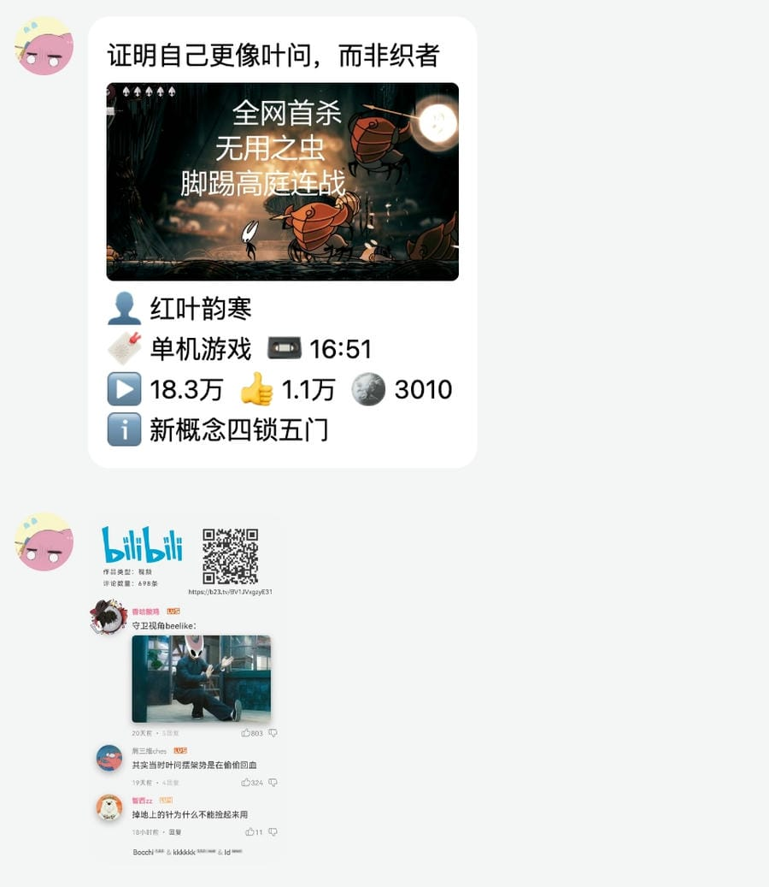

  

# nonebot-plugin-bili-helper

_✨ 一个自动解析群聊内的 B 站分享信息、热评截图的插件 ✨_

> 评论模板来自: [https://github.com/ikenxuan/kkkkkk-10086](https://github.com/ikenxuan/kkkkkk-10086)

提前声明

1. 本插件并不提供视频下载能力（个人觉得群聊里出现大量下载的视频片段挺烦的，经常触发自动下载还占用手机和电脑的空间）。
2. 只适配和测试了 onebot v11 适配器的场景，其他环境未做处理，不确保可用性。

## 📖 介绍

这是一个 nonebot2 插件项目，支持对群聊内分享 B 站视频进行相关信息的解析与提取。

1. 对于群聊里出现的 B 站小程序、卡片分享，提取对应链接，方便 PC 端打开；
2. 对于只有视频链接的情况，补充视频封面、详情等信息。
3. 评论区热评截图预览，可供判断视频质量（截图基于 nonebot-plugin-htmlrender 插件）。

## 💿 安装

使用 nb-cli 安装

在 nonebot2 项目的根目录下打开命令行, 输入以下指令即可安装

    nb plugin install nonebot-plugin-bili-helper

使用包管理器安装

在 nonebot2 项目的插件目录下, 打开命令行, 根据你使用的包管理器, 输入相应的安装命令

pip

    pip install nonebot-plugin-bili-helper

pdm

    pdm add nonebot-plugin-bili-helper

poetry

    poetry add nonebot-plugin-bili-helper

conda

    conda install nonebot-plugin-bili-helper

打开 nonebot2 项目根目录下的 `pyproject.toml` 文件, 在 `[tool.nonebot]` 部分追加写入

    plugins = ["nonebot_plugin_template"]

## ⚙️ 配置

在 nonebot2 项目的`.env`文件中添加下表中的必填配置

| 配置项 | 必填 | 默认值 | 说明 |
|:-----:|:----:|:----:|:----:|
| analysis_whitelist | 否 | 无 | 触发人白名单（留空时为所有人） |
| analysis_group_whitelist | 否 | 无 | 目标群组白名单（留空时为所有群组） |
| analysis_blacklist | 否 | 无 | 触发人黑名单 |
| analysis_group_blacklist | 否 | 无 | 目标群组黑名单 |
| analysis_group_strategies | 否 | 无 | 群组策略（格式为 `dict[str, list]`，其中 `list` 为 `'detail', 'link', 'comments'` 组成的数组。如配置 `{ "123": ["comments"] }` 说明对群组 123 仅做评论解析） |

## 🎉 使用

### 指令表
| 指令 | 权限 | 需要@ | 范围 | 说明 |
|:-----:|:----:|:----:|:----:|:----:|
| 设置B站Cookie | 主人 | 否 | 私聊 | 设置请求时的Cookie（以便获得更详细的评论数据） |

